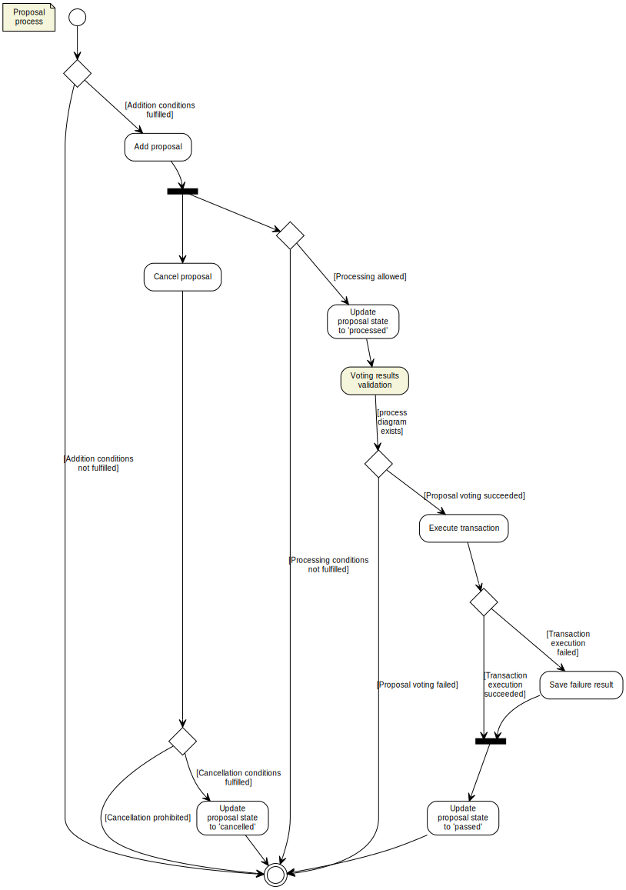

# DAO activities diagrams

>* Following diagrams are visualized using [yUML](https://github.com/jaime-olivares/vscode-yuml) VSCode extension  

## [Proposal process](./proposal.yuml) 

## [Voting process](./voting.yuml) 

## [Voting results validation](./voting-validation.yuml) - part of the Voting process

