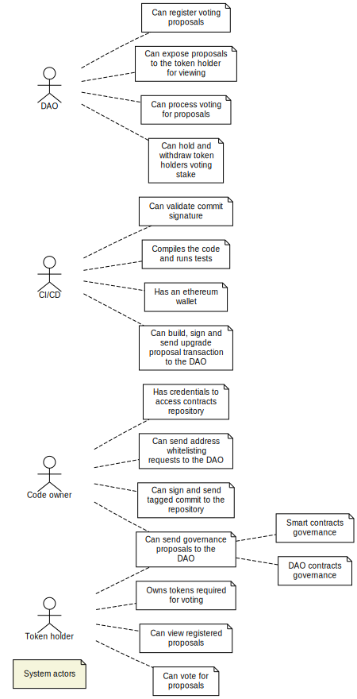
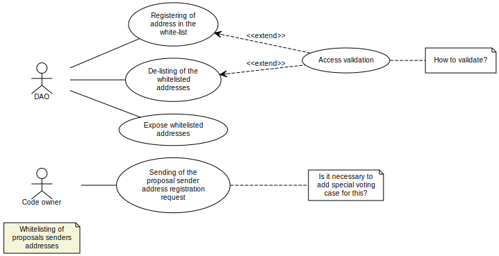
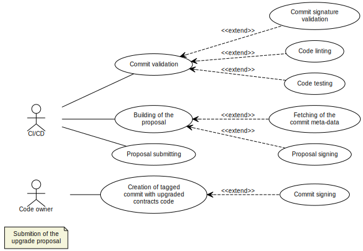
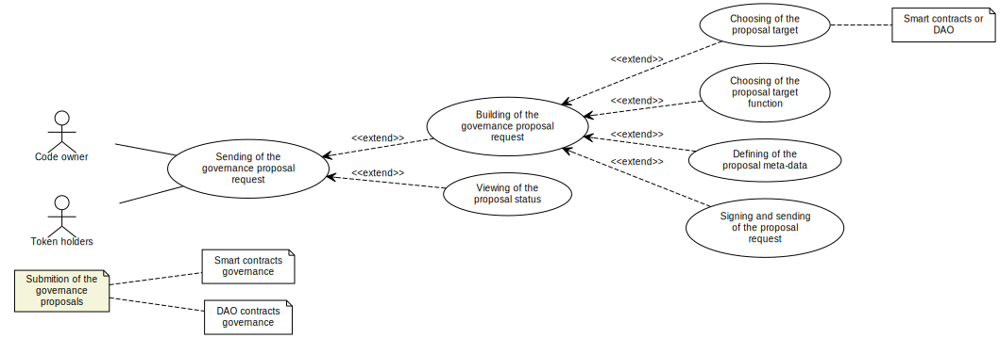
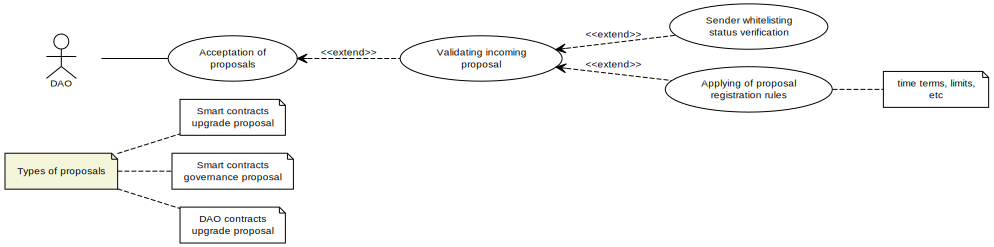
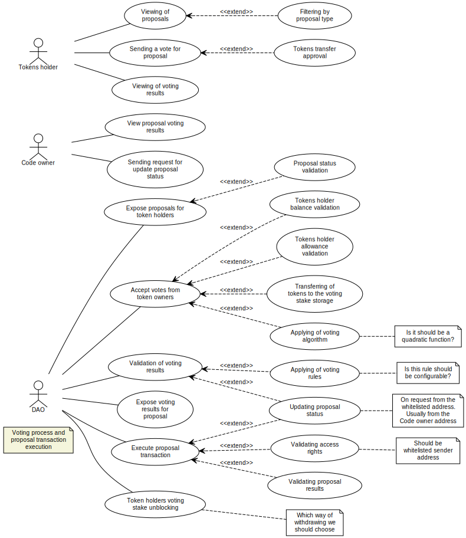

# DAO use-cases

>* Following diagrams are visualized using [yUML](https://github.com/jaime-olivares/vscode-yuml) VSCode extension  
>* Use-cases diagrams should be reading from bottom to top (due to the fact that the visualization tool renders the diagrams in reverse order) 

## [Actors](./actors.yuml) 

## [Whitelisting](./whitelisting.yuml) 

## [Smart contracts upgrade proposals submition](./upgrade.yuml) 

## [Governance proposals submition](./governance.yuml) 

## [Proposals acceptation](./proposals.yuml) 

## [Voting process and proposal transactions execution](./voting.yuml) 

